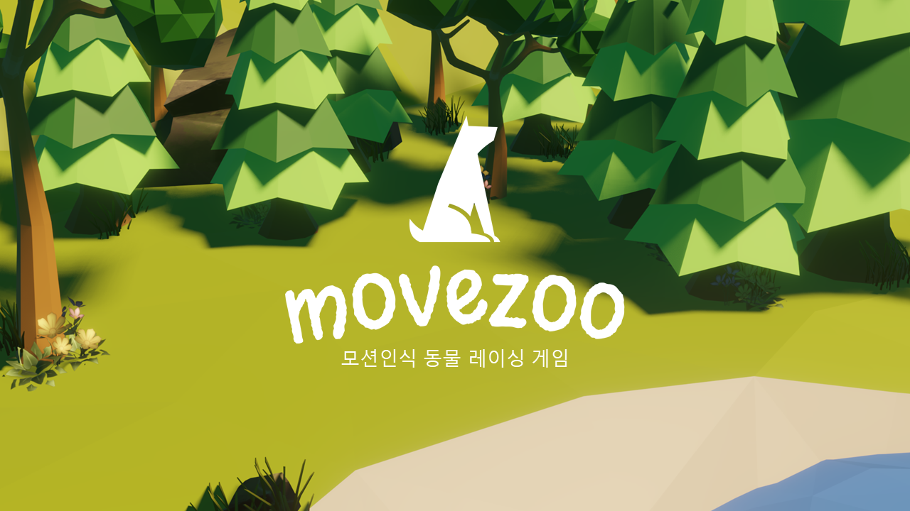
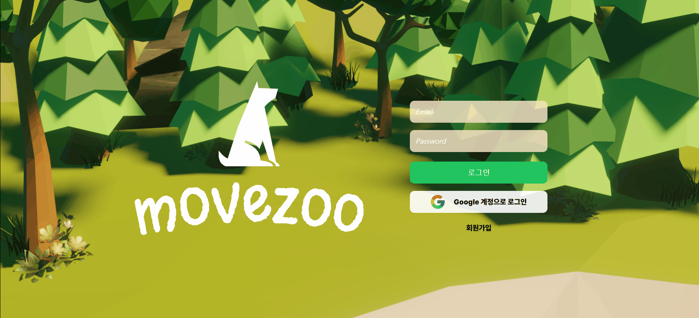
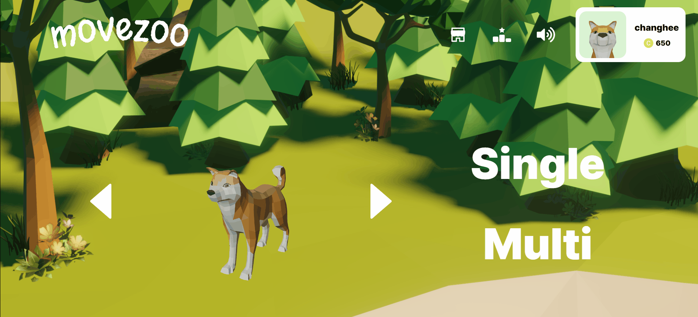
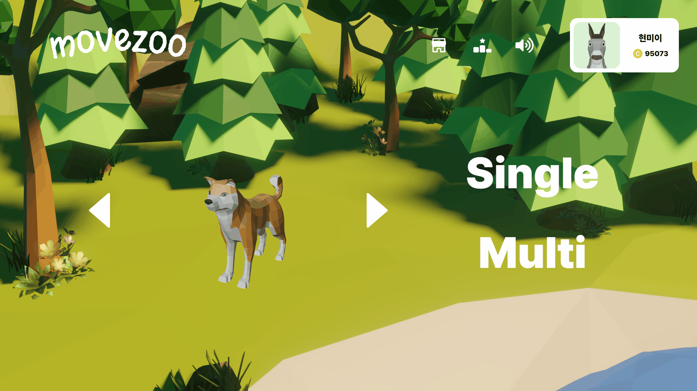
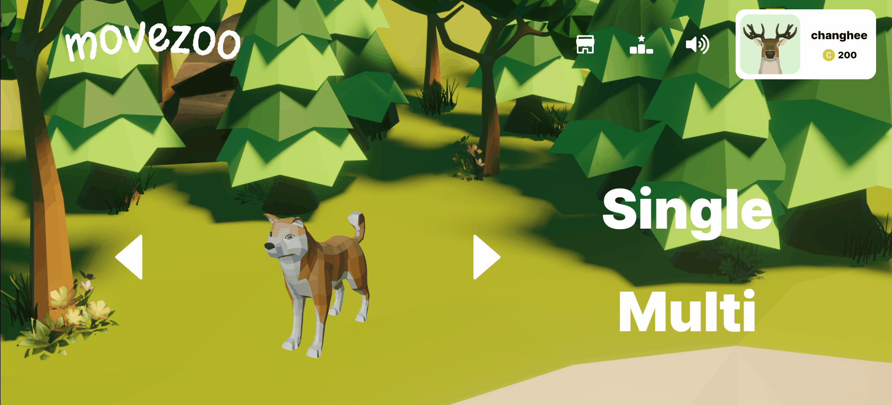
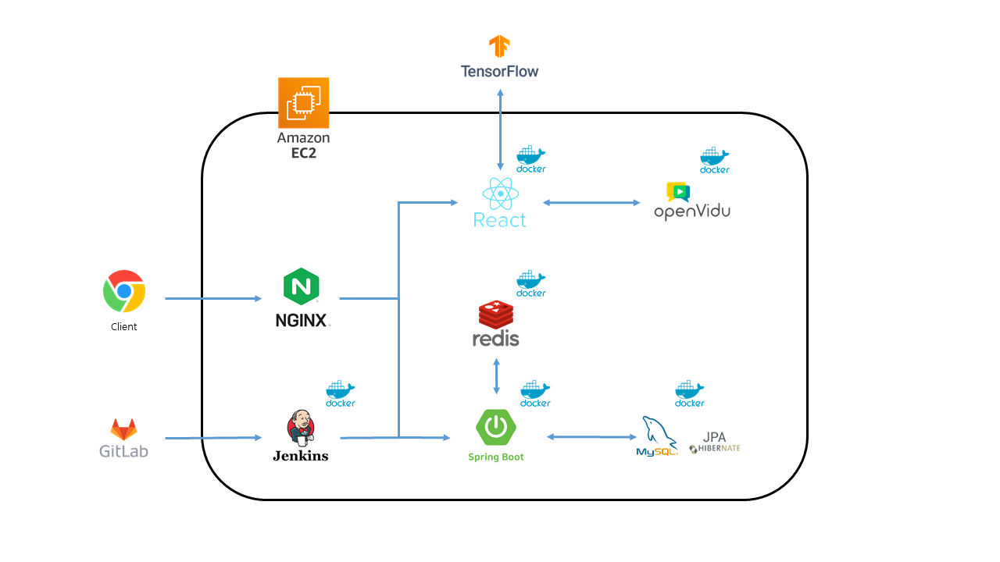
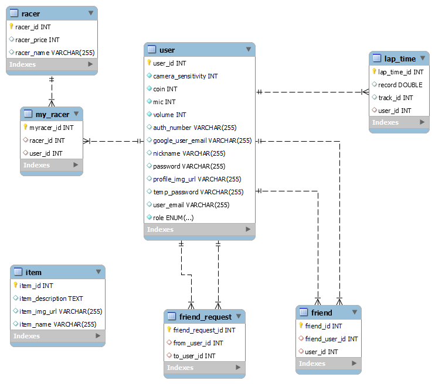

# 🐕‍🦺 **움직여! Zoo**
 

<br>

## 😎 개요

  팀명: **소통의 정원**  
  서비스명: **움직여 Zoo!**  
  개발기간: **2024년 1월 8일 ~ 2월 16일 (7주)**


<br>

## 🌱 소통의 정원 팀원 소개 🌱
|||||||
|:--:|:--:|:--:|:--:|:--:|:--:|
|위재원|김창희|이현민|신현기|정세진|최용훈
|Backend<br>팀장|Backend<br>CI/CD|Frontend|Frontend|Frontend|Frontend|
|API 및 DB 설계<br>Game Asset 제작<br>UCC 제작<br>|API 및 DB 설계<br>WebRTC 구현<br>CI/CD 구축|UI/UX 기획 및 설계<br>Game 개발<br>Game Asset 제작<br>디버깅 및 최적화|UI/UX 기획 및 설계<br>Game 개발<br>Game Asset 제작<br>사용자 상태 관리|UI/UX 기획 및 설계<br>WebRTC 구현<br>|UI/UX 기획 및 설계<br>사용자 상태 관리|

<br/>
<br/>


## 😊 서비스 소개
기존에도 많은 모션인식 게임이 있습니다.<br>
하지만 기존의 모션인식 게임은 비싼 장비가격으로 일반적으로 즐기기엔 접근성이 좋지 않습니다.<br>

그래서! 저희는 **WebRtc와 모션인식 기능**을 결합하여 사용자들의 접근성을 높이고자 합니다.<br>
***움직여! zoo***는 흔히 사용하는 키보드가 아닌 웹캠을 통해 **사용자의 움직임을 인식하여 조작**하는 **신선한** 방식의 레이싱 게임입니다.<br>
**싱글, 멀티, 아이템** 모드와 **특색있는 맵**을 즐기고 재화를 모아 **귀여운 캐릭터**를 해금해보세요!


<br/>

## 🎇 주요 서비스

|||
|---|---|
|||
|`메인화면` 회원가입 / 로그인 |`로비화면` 사용자 보유 캐릭터 열람|
|||
|`상점` 재화로 미보유 캐릭터 구매|`프로필` 프로필이미지, 닉네임, 비밀번호 변경|
|||
|`싱글 플레이` 혼자서 플레이하는 모드|`랭킹` 싱글 플레이 최단기록 랭킹|
|||
|`멀티 플레이` 다른 사용자와 함께 플레이|`보상 시스템` 결과에 따른 재화 제공|

<br/>


## ⚙ 사용 기술

#### **FE**


#### **BE**


#### **CI/CD**


 

 


#### **협업**


<br/>
<br/>

## 🧱 서비스 아키텍쳐


<br/>

## 📁 프로젝트 구조

### **Backend**
<details><summary>펼치기 / 접기</summary>

```
backend
├─main
│  ├─java
│  │  └─com
│  │      └─ssafy
│  │          └─movezoo
│  │              ├─auth
│  │              │  ├─config
│  │              │  │  └─details
│  │              │  ├─controller
│  │              │  ├─dto
│  │              │  ├─sevice
│  │              │  └─util
│  │              ├─friendship
│  │              │  ├─controller
│  │              │  ├─domain
│  │              │  ├─dto
│  │              │  ├─repository
│  │              │  └─service
│  │              ├─game
│  │              │  ├─controller
│  │              │  ├─domain
│  │              │  ├─dto
│  │              │  ├─repository
│  │              │  └─serivce
│  │              ├─global
│  │              │  ├─config
│  │              │  ├─dto
│  │              │  ├─entity
│  │              │  └─init
│  │              ├─openvidu
│  │              │  ├─controller
│  │              │  └─dto
│  │              └─user
│  │                  ├─controller
│  │                  ├─domain
│  │                  ├─dto
│  │                  ├─repository
│  │                  └─sevice
│  └─resources
└─test
    └─java
        └─com
            └─ssafy
                └─movezoo


```
</details>

<br/>

### **FrontEnd**
<details><summary>펼치기 / 접기</summary>  

```
movezoo
├─ .gitignore
├─ jsconfig.json
├─ package-lock.json
├─ package.json
├─ README.md
├─ src
│  ├─ App.js
│  ├─ components
│  │  ├─ home
│  │  │  ├─ GoogleLogin.css
│  │  │  ├─ GoogleLoginButton.js
│  │  │  ├─ Loading.js
│  │  │  ├─ Login.css
│  │  │  ├─ Login.js
│  │  │  ├─ Setpassword.js
│  │  │  ├─ Signup.css
│  │  │  └─ Signup.jsx
│  │  ├─ main
│  │  │  ├─ carousel
│  │  │  │  ├─ Carousel.css
│  │  │  │  └─ Carousel.js
│  │  │  └─ profile
│  │  │     ├─ imagechange
│  │  │     │  ├─ ImageChange.css
│  │  │     │  └─ ImageChange.js
│  │  │     ├─ logout
│  │  │     │  ├─ Logout.css
│  │  │     │  └─ Logout.js
│  │  │     ├─ nicknamechange
│  │  │     │  ├─ NicknameChange.css
│  │  │     │  └─ NicknameChange.js
│  │  │     ├─ passwordchange
│  │  │     │  ├─ PasswordChange.css
│  │  │     │  └─ PasswordChange.js
│  │  │     ├─ Profile.css
│  │  │     └─ Profile.js
│  │  ├─ multi
│  │  │  ├─ Back.js
│  │  │  ├─ Back.module.css
│  │  │  ├─ Chat.js
│  │  │  ├─ Chat.module.css
│  │  │  ├─ Map.js
│  │  │  ├─ Map.module.css
│  │  │  ├─ Ready.js
│  │  │  └─ Ready.module.css
│  │  ├─ navbar
│  │  │  ├─ friend
│  │  │  │  ├─ Friend.css
│  │  │  │  └─ Friend.js
│  │  │  ├─ Navbar.css
│  │  │  ├─ Navbar.js
│  │  │  ├─ ranking
│  │  │  │  ├─ Ranking.css
│  │  │  │  └─ Ranking.js
│  │  │  ├─ setting
│  │  │  │  ├─ Setting.css
│  │  │  │  └─ Setting.js
│  │  │  └─ shop
│  │  │     ├─ character
│  │  │     │  ├─ black.png
│  │  │     │  ├─ Character.css
│  │  │     │  └─ Character.js
│  │  │     ├─ Shop.css
│  │  │     └─ Shop.js
│  │  ├─ play
│  │  │  ├─ Cam.css
│  │  │  ├─ Cam.js
│  │  │  ├─ common.js
│  │  │  ├─ data.js
│  │  │  ├─ gameConstants.js
│  │  │  ├─ Main.js
│  │  │  ├─ MyOvVideo.js
│  │  │  ├─ MyOvVideo____.js
│  │  │  ├─ MyVideoComponent.js
│  │  │  ├─ registerServiceWorker.js
│  │  │  ├─ reportWebVitals.js
│  │  │  ├─ stats.js
│  │  │  ├─ UserOvVideo.js
│  │  │  ├─ UserVideo.css
│  │  │  ├─ UserVideoComponent.js
│  │  │  └─ utilities.js
│  │  ├─ room
│  │  │  ├─ Makeroom.css
│  │  │  └─ Makeroom.js
│  │  └─ single
│  │     ├─ Back.js
│  │     ├─ Back.module.css
│  │     ├─ game
│  │     │  ├─ Back.js
│  │     │  └─ Back.module.css
│  │     ├─ Map1.js
│  │     ├─ Map2.js
│  │     ├─ Map2.module.css
│  │     ├─ result
│  │     │  ├─ Back.js
│  │     │  ├─ Back.module.css
│  │     │  ├─ Record.js
│  │     │  └─ Record.module.css
│  │     ├─ Start.js
│  │     └─ Start.module.css
│  ├─ index.css
│  ├─ index.js
│  └─ pages
│     ├─ home
│     │  ├─ Home.css
│     │  └─ Home.jsx
│     ├─ main
│     │  ├─ Main.css
│     │  └─ Main.js
│     ├─ multi
│     │  ├─ game
│     │  │  ├─ MultiGame.js
│     │  │  └─ MultiGame.module.css
│     │  ├─ Multi.js
│     │  ├─ Multi.module.css
│     │  └─ result
│     │     ├─ MultiResult.js
│     │     └─ MultiResult.module.css
│     ├─ room
│     │  ├─ Room.css
│     │  └─ Room.js
│     └─ single
│        ├─ game
│        │  ├─ Game.js
│        │  └─ Game.module.css
│        ├─ result
│        │  ├─ Result.js
│        │  └─ Result.module.css
│        ├─ Single.js
│        └─ Single.module.css
└─ tailwind.config.js

```
</details>

<br/>

## 📊 ERD



<br/>

## 💬 API 명세서


<br/>

## 프로젝트 기록


<!-- ## 🖼️ 와이어프레임 -->
<!--  -->